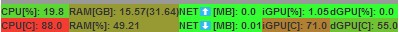

# pyFloatingHardwareStats
Floating window GUI that displays various hardware statistics. Main features:
- has a tiny grey area that can be used to drag the window wherever the user wants
- spawns separate threads that take care of reading specific hardware statistics at pre-defined time intervals
- has a main thread that updates the window each 0.5s with pre-defined statistics
- most of the statistics will get colored with each update with a color between green (low load) and red (high load)
- is assured to stay on top of everything on your desktop (even the taskbar)
- the basic statistics are read directly through python-windows APIs (CPU usage, RAM usage, network usage ...) but for the more complex ones [LibreHardwareMonitor](https://github.com/LibreHardwareMonitor/LibreHardwareMonitor/releases) needs to be installed and opened (like CPU temperature)

# LibreHardwareMonitor sensor name setup

For network and disk activity to work, you must **rename** the following hardware nodes in LibreHardwareMonitor (right-click → Rename):

| Hardware | Rename to |
|----------|-----------|
| Your network adapter (e.g. "Intel(R) Ethernet Connection ..." or "Realtek PCIe GbE ...") | `adapter1` |
| Your primary disk (e.g. "Samsung SSD 970 EVO ...") | `disk1` |
| Your secondary disk (if any) | `disk2` |

If you don't rename them, network and disk stats will show as zero.

# GUI layout

# Support
Found this project useful? Send your ❤ in any form you can 🙂. Please contact me if you donated and want to be added to the contributors list !

- chia XCH---xch1glz7ufrfw9xfp5rnlxxh9mt9vk9yc8yjseet5c6u0mmykq8cpseqna6494
